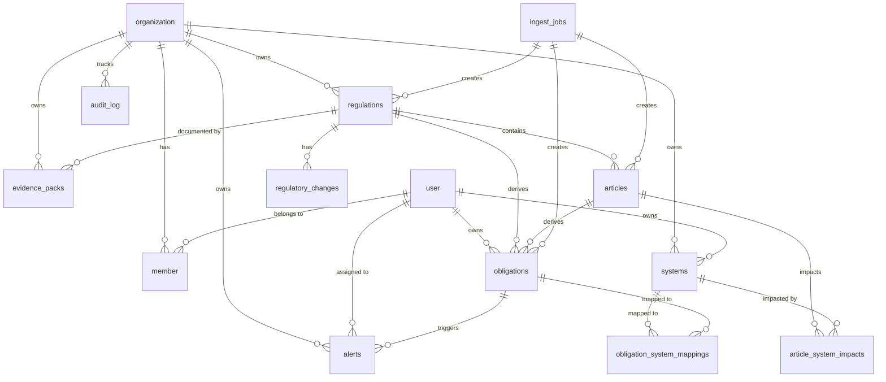

# Cindral Database Architecture

> Complete reference for the Cindral database schema, conventions, and operations.

## Overview

Cindral uses **PostgreSQL 15+** with **Drizzle ORM** for type-safe database operations. The schema is designed for multi-tenant SaaS with strict organization isolation.

## Entity Relationship Diagram



## Core Tables

### Multi-Tenancy

| Table          | Purpose          | Key Columns                          |
| -------------- | ---------------- | ------------------------------------ |
| `organization` | Tenant container | `id`, `name`, `slug`                 |
| `user`         | User accounts    | `id`, `email`, `name`                |
| `member`       | Org membership   | `user_id`, `organization_id`, `role` |
| `session`      | Auth sessions    | `token`, `user_id`, `expires_at`     |

### Regulatory Content

| Table                | Purpose              | Key Columns                                      |
| -------------------- | -------------------- | ------------------------------------------------ |
| `regulations`        | DORA, GDPR, etc.     | `id`, `name`, `framework`, `status`              |
| `articles`           | Individual articles  | `id`, `regulation_id`, `article_number`, `title` |
| `obligations`        | Derived requirements | `id`, `article_id`, `status`, `risk_level`       |
| `regulatory_changes` | Change feed          | `regulation_id`, `title`, `severity`             |

### Compliance Tracking

| Table                        | Purpose                     | Key Columns                               |
| ---------------------------- | --------------------------- | ----------------------------------------- |
| `systems`                    | IT systems                  | `id`, `name`, `criticality`, `tags`       |
| `article_system_impacts`     | Article → System mapping    | `article_id`, `system_id`, `impact_level` |
| `obligation_system_mappings` | Obligation → System mapping | `obligation_id`, `system_id`              |
| `alerts`                     | Compliance alerts           | `id`, `type`, `severity`, `status`        |
| `evidence_packs`             | Generated documentation     | `id`, `regulation_id`, `status`           |

### Audit & Operations

| Table         | Purpose        | Key Columns                                  |
| ------------- | -------------- | -------------------------------------------- |
| `audit_log`   | All mutations  | `action`, `entity_type`, `entity_id`, `diff` |
| `ingest_jobs` | Data ingestion | `source`, `status`, `started_at`             |

## Column Conventions

### Standard Columns

Every table includes:

```sql
created_at TIMESTAMP NOT NULL DEFAULT NOW()
updated_at TIMESTAMP NOT NULL DEFAULT NOW()  -- Auto-updated via Drizzle
```

### Soft Delete

Core entities support soft deletion:

```sql
deleted_at TIMESTAMP  -- NULL = active, timestamp = deleted
```

**Tables with soft delete:**

- `regulations`
- `articles`
- `obligations`
- `systems`
- `alerts`
- `evidence_packs`

### Organization Scoping

All tenant data includes:

```sql
organization_id TEXT NOT NULL REFERENCES organization(id) ON DELETE CASCADE
```

**Important:** Always filter by `organization_id` in queries.

## Enums

| Enum                | Values                                                                        | Used In                    |
| ------------------- | ----------------------------------------------------------------------------- | -------------------------- |
| `role`              | OrgAdmin, ComplianceManager, Auditor, Viewer, BillingAdmin                    | member                     |
| `severity`          | info, low, medium, high, critical                                             | alerts, regulatory_changes |
| `alert_status`      | open, in_triage, in_progress, resolved, wont_fix                              | alerts                     |
| `alert_type`        | obligation_overdue, regulation_changed, evidence_pack_failed, system_unmapped | alerts                     |
| `obligation_status` | not_started, in_progress, implemented, under_review, verified                 | obligations                |
| `requirement_type`  | process, technical, reporting                                                 | obligations                |
| `risk_level`        | low, medium, high, critical                                                   | obligations                |
| `impact_level`      | critical, high, medium, low                                                   | article_system_impacts     |
| `evidence_status`   | draft, generating, ready, failed, archived                                    | evidence_packs             |
| `regulation_status` | active, superseded, draft                                                     | regulations                |
| `source_type`       | eur-lex, manual-upload, api, llm, manual                                      | regulations, articles      |
| `ingest_job_status` | pending, running, succeeded, failed, partial                                  | ingest_jobs                |

## Indexes

### Performance Indexes

```sql
-- Organization-scoped queries (all tables)
CREATE INDEX idx_<table>_org_id ON <table>(organization_id);

-- Status filtering
CREATE INDEX idx_alerts_org_status ON alerts(organization_id, status);
CREATE INDEX idx_obligations_org_status ON obligations(organization_id, status);

-- Date-based queries
CREATE INDEX idx_alerts_org_created ON alerts(organization_id, created_at DESC);
CREATE INDEX idx_obligations_due_date ON obligations(organization_id, due_date);

-- JSONB queries
CREATE INDEX idx_alerts_context ON alerts USING GIN(context);

-- Array queries
CREATE INDEX idx_systems_tags ON systems USING GIN(tags);
```

### Unique Constraints

```sql
-- Prevent duplicate slugs per org
UNIQUE (organization_id, slug) ON regulations
UNIQUE (organization_id, slug) ON systems

-- Prevent duplicate mappings
UNIQUE (organization_id, article_id, system_id) ON article_system_impacts
UNIQUE (organization_id, obligation_id, system_id) ON obligation_system_mappings
```

## Query Patterns

### Always Filter by Organization

```typescript
// ✅ Correct - scoped to organization
const alerts = await db.query.alerts.findMany({
  where: eq(alerts.organizationId, ctx.activeOrganizationId),
})

// ❌ Wrong - leaks data across orgs
const alerts = await db.query.alerts.findMany({
  where: eq(alerts.status, 'open'),
})
```

### Soft Delete Filtering

```typescript
// Active records only
const systems = await db.query.systems.findMany({
  where: and(eq(systems.organizationId, orgId), isNull(systems.deletedAt)),
})

// Include deleted (for admin views)
const allSystems = await db.query.systems.findMany({
  where: eq(systems.organizationId, orgId),
})
```

### Optimistic Locking

```typescript
// Update with version check
const result = await db
  .update(regulations)
  .set({
    name: 'New Name',
    lockVersion: sql`${regulations.lockVersion} + 1`,
  })
  .where(and(eq(regulations.id, id), eq(regulations.lockVersion, currentVersion)))
  .returning()

if (result.length === 0) {
  throw new Error('Concurrent modification detected')
}
```

## Migrations

### Running Migrations

```bash
# Development - push schema directly
npm run db:push

# Production - generate and apply migrations
npm run db:generate   # Creates migration file
npm run db:migrate    # Applies migrations
```

### Migration Files

Located in `/drizzle/`:

| File                            | Purpose                           |
| ------------------------------- | --------------------------------- |
| `0001_initial_schema.sql`       | Base schema                       |
| `0002_schema_refinements.sql`   | Enum additions, column fixes      |
| `0003_production_hardening.sql` | Indexes, constraints, soft-delete |

## Backup & Restore

### Creating Backups

```bash
# Local backup
npm run db:backup

# With S3 upload
S3_BUCKET=my-bucket npm run db:backup
```

Backups are created in `./backups/` with format: `cindral_<db>_<timestamp>.sql.gz`

### Restoring Backups

```bash
# Restore from local file
npm run db:restore ./backups/cindral_db_20240101_120000.sql.gz

# Restore from S3
npm run db:restore s3://my-bucket/backups/cindral_db_20240101_120000.sql.gz
```

### Backup Retention

- Local: 30 days (configurable via `RETENTION_DAYS`)
- S3: Same retention policy, cleaned automatically

## Environment Variables

| Variable             | Required | Default   | Description                  |
| -------------------- | -------- | --------- | ---------------------------- |
| `DATABASE_URL`       | Yes      | -         | PostgreSQL connection string |
| `DATABASE_POOL_SIZE` | No       | 10        | Max connections in pool      |
| `BACKUP_DIR`         | No       | ./backups | Local backup directory       |
| `S3_BUCKET`          | No       | -         | S3 bucket for remote backups |
| `RETENTION_DAYS`     | No       | 30        | Days to keep backups         |

## Connection Pool

Configured for serverless/edge environments:

```typescript
const poolConfig = {
  max: process.env.NODE_ENV === 'production' ? 20 : 5,
  idle_timeout: 20, // Close idle after 20s
  connect_timeout: 10, // Fail connect after 10s
  max_lifetime: 1800, // Refresh every 30min
  prepare: false, // Disable prepared statements
}
```

## Audit Logging

All mutations are automatically logged via the audit system:

```typescript
// Automatic via withAudit wrapper
await withAudit(ctx, 'update_system', 'system', systemId, async () => {
  // Your mutation here
})
```

Audit log includes:

- `action` - What happened (create_alert, update_system, etc.)
- `entity_type` - Table name
- `entity_id` - Record ID
- `diff` - Before/after JSON
- `actor_user_id` - Who made the change
- `session_id` - Session correlation
- `request_id` - Request correlation

## Security Considerations

1. **Row-Level Security**: All queries MUST include `organization_id` filter
2. **Cascade Deletes**: Org deletion removes all related data
3. **Soft Deletes**: Audit trail preserved for compliance
4. **Connection Security**: Use SSL in production (`?sslmode=require`)
5. **Credential Rotation**: Support via DATABASE_URL update (no code change)

## Performance Tips

1. Use `EXPLAIN ANALYZE` for slow queries
2. Add indexes for frequent filter columns
3. Use cursor pagination for large datasets
4. Batch inserts/updates (max 1000 rows)
5. Monitor connection pool usage in production
